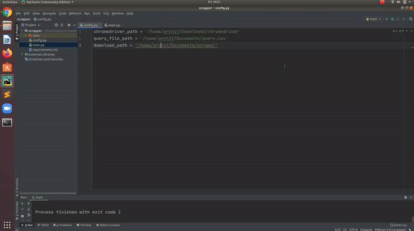

# Scrapper
Scrapper is a python script to create a <i>ML/DL dataset using Selenium</i>. <i>Selenium</i> automates the web browser operations using <i>browser-drivers</i>. In this project we have used <i>Google Chrome</i> whose drivers can be found using [link](https://chromedriver.chromium.org/).
## Blog post with more details:
Creating a Machine/Deep Learning Dataset from Google Images using Selenium

## Demo :



## Setting up the Environment :

Setup a <i>virtual environment</i> using <i>Pycharm</i> or <i>pip</i>. Install the <i>dependencies</i> and requirements using

```$ pip install -r requirements.txt```

## Configuring the parameters :

### Query File :
Setup or edit the query file containing all the <i>keyword</i> and <i>corresponding number of images</i> and <i>resolution of the images</i> in the dataset in the <i>Data</i> folder in the cloned repository. 

### config.py
All the variables and configurations for the code are stored in the <i>config.py</i>. <br>

* <i><b>chromedriver_path</b></i> : Depicts the location of the unzipped chromedriver files.</br>
* <i><b>query_file_path</b></i> : Depicts the path for the location of the query file.<br>
* <i><b>Download_path</b></i> : Depicts the download location of the dataset.</ul>

## Scraping :
The scraper file is the <i>main.py</i> .Run the <i>main.py</i> file to download the dataset base on the <i>query file</i> created.<br>
<br><b>Note</b>: The scrapper might produce some error while scrapping and return <i>NULL URL set</i>, to tackle that try-except block has been used, in that case, try re-running the code or changing the parameters in <i>query.csv</i>


